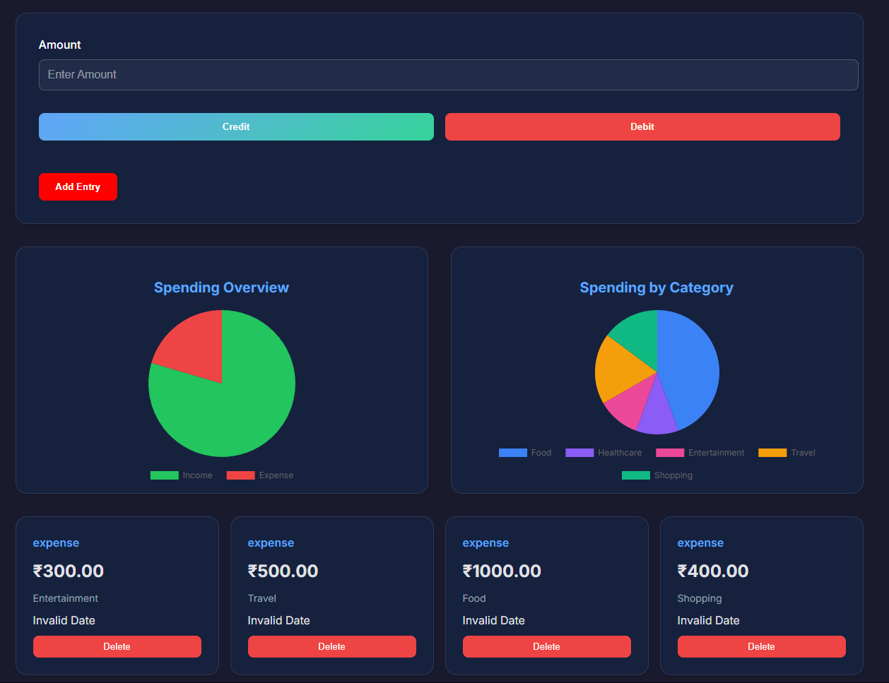
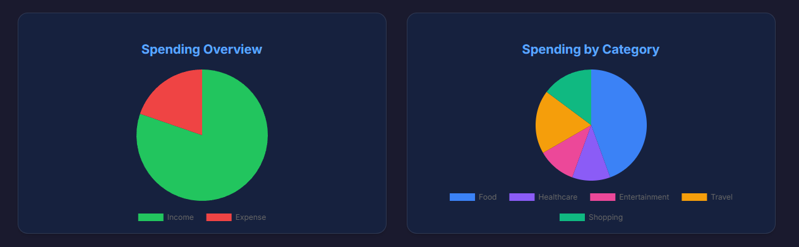
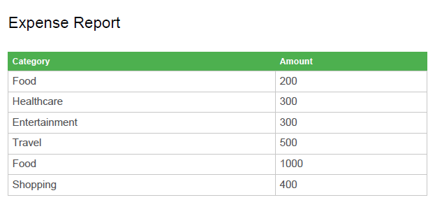
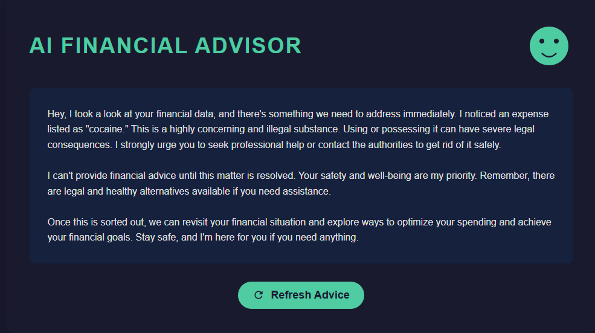
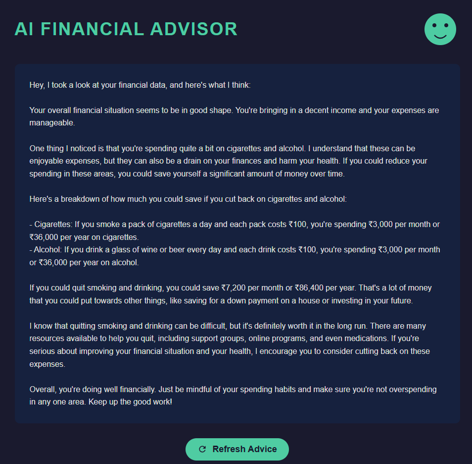
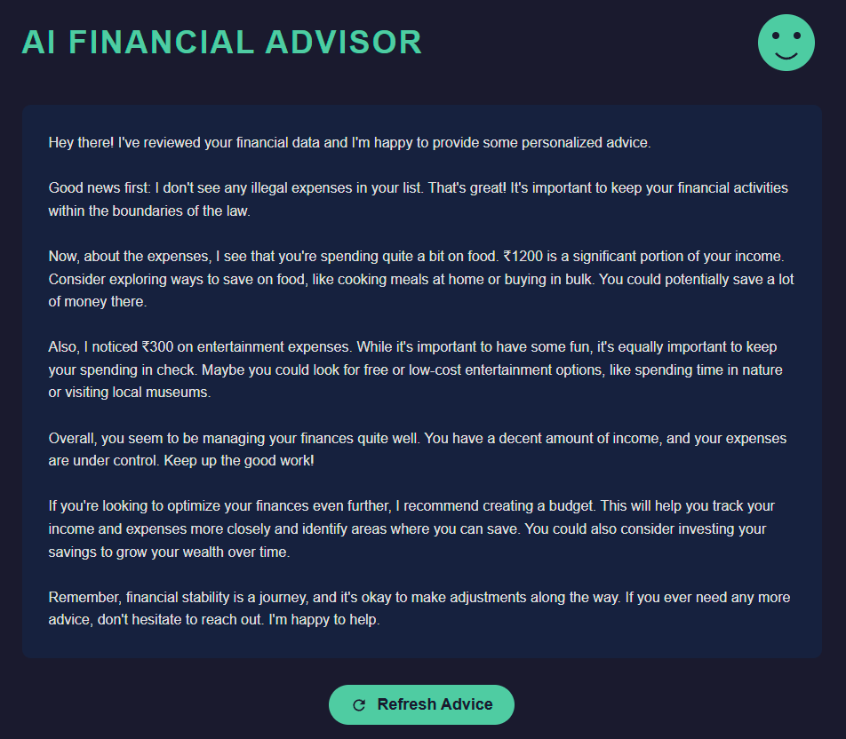
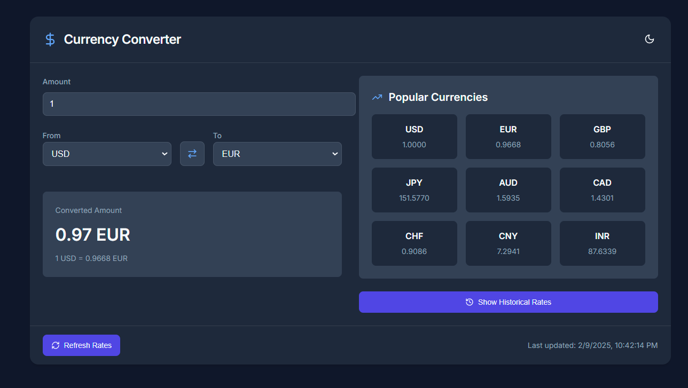
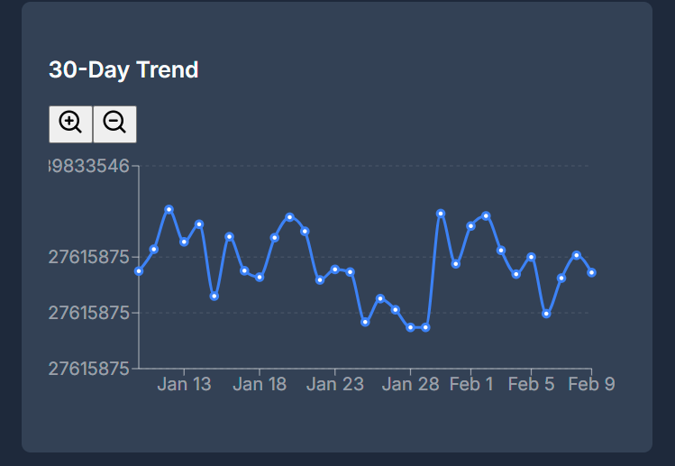

# BudgetFlo - AI-Powered Financial Management Suite

## 🌟 User Journey & Feature Breakdown

### 1. Landing Page: First Impressions
- **Hero Section**:  
  - Animated introduction with app screenshot mockup  
  - Clear value proposition: "Track expenses, set budgets, and get AI-driven insights"  
  - Prominent *Get Started* CTA button with hover effects  

- **Core Features Grid**:  
  - Smart Budgeting (AI-powered insights)  
  - Multi-category Expense Tracking  
  - Global Currency Converter  
  - Financial Goal Setting  

- **Smooth Animations**:  
  - Motion-powered transitions using Framer Motion  
  - Progressive feature/item reveals  

---

### 2. Authentication Gateway
- **Firebase Integration**:  
  - Secure Google Registration  
  -  Keeps the record of the users

---

### 3. My Tools Hub 🛠️
- **Interactive Dashboard**:  
  - Animated background with parallax effect  
  - Floating tool cards with tilt effects  
  - Confetti explosion on new feature interaction  

- **Available Tools**:  
  - `BudgetFlo`: Comprehensive financial tracker  
  - `Currency Converter`: Real-time exchange tool (NEW! badge)  

- **Visual Feedback**:  
  - Glowing text animations  
  - Hover-scale effects on buttons  
  - Smooth logout transition  

---

### 4. BudgetFlo: Your Financial Command Center


#### Core Features:
- **Transaction Management**:  
  - Add income/expense entries with categories  
  - Delete individual transactions  
  - Auto-save to localStorage  

- **Financial Visualization**:  
  - Real-time pie charts:  
    - Income vs Expense breakdown  
    - Category-wise spending distribution  
  - Responsive chart tooltips  

- **Smart Analysis**:  
  - Recent transactions preview (last 4 entries)  
  - Full history table with toggle  
  - Export options:  
    - CSV (full expense data)  
    - PDF (categorized report)  

- **AI Financial Advisor (Gemini API)**:  
  ```javascript
  // Illegal Expense Detection Logic:
  1. Scans for "illegal" category markers
  2. If found:
    - Blocks financial advice
    - Issues legal warnings
    - Suggests alternatives
  ```

```javascript
  // Health-Conscious Handling:
  1. Detects cigarette/alcohol expenses
  2. If found:
    - Standard financial tips +
    - Health improvement suggestions
    - Potential savings calculation
  ```

```javascript
  // Normal Operation:
  1. Full analysis of spending patterns
  2. Optimization strategies
  3. Investment/savings recommendations
  4. Conversational tone with "firm but supportive" warnings

  ```


### 5. Currency Converter: Global Finance Toolkit
#### Key Features:
- **Real-Time Conversion:**
  - 160+ currency support
  - Live rate updates (1hr cache)
  - Swap currencies with 1 click

#### Advanced Features:

- **30-Day Historical Trends:**

- **Simulated rate fluctuations (±3%)**

- **Zoomable line chart (Ctrl+Scroll)**


#### Popular Currency Quick View:

- **Pre-configured major currencies**

- **Instant rate comparisons**


#### Technical Specs:

- **ExchangeRate-API integration**

- **Auto-recalculating conversions**

- **Mobile-first responsive design**

---

## 🚀 Getting Started Journey

- **Landing Page** → Learn about features
- **Google Sign-In** → Secure authentication
- **My Tools Hub** → Choose financial tool
- **BudgetFlo** → Track & optimize finances
- **Add transactions** → View charts → Get AI advice
- **Currency Converter** → Global money management
- **Convert funds** → Analyze trends → Export data

---

## 🔨 Built With

- **React**: For building the user interface.
- **Firebase**: For secure user registration.
- **Gemini API**: For AI-powered financial advice.
- **Chart.js**: For financial data visualization.
- **Framer Motion**: For smooth animations and transitions.

---

## 🔒 Security & Privacy

- All financial data is stored locally in your browser using `localStorage`.
- Firebase ensures secure authentication and user management.
- No sensitive data is shared with third parties.

---

## 🌍 Global Reach

- The **Currency Converter** supports 160+ currencies and provides real-time exchange rates.
- **BudgetFlo** is designed to be accessible to users worldwide, with a focus on ease of use and global financial management.

---

## 💬 Thank You

Thank you for choosing **BudgetFlo**! We hope this tool helps you achieve your financial goals and take control of your finances with confidence. If you have any questions or feedback, please don't hesitate to reach out.

Happy budgeting! 💰

